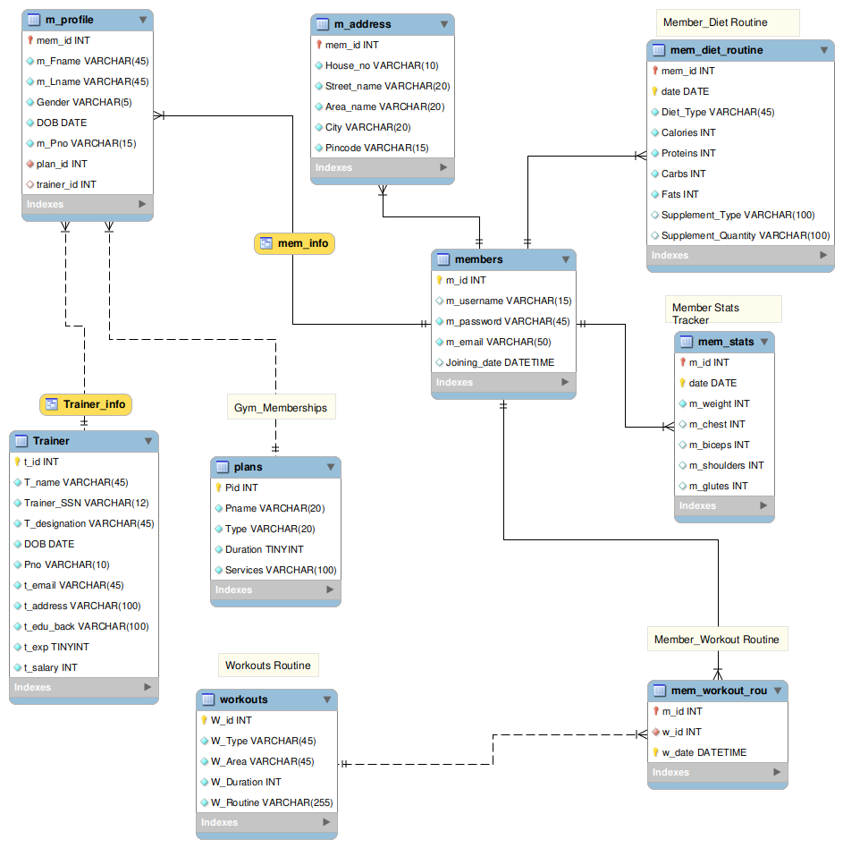

<!-- PROJECT LOGO -->
 
  <h2 align="center">Pain2Gain Exercise Tracker</h2>

  

    Monitor your workouts,diet plans and body stats.
     
  

<!-- TABLE OF CONTENTS -->

  
Table of Contents

  <ol>
    <li>
      <a href="#about-the-project">About The Project</a>
      <ul>
        <li><a href="#built-with">Built With</a></li>
      </ul>
    </li>
     <li><a href="#Getting-Started">Getting Started</a></li>
    <li><a href="#usage">Usage</a></li>
    <li><a href="#roadmap">Roadmap</a></li>
  </ol>

<!-- ABOUT THE PROJECT -->
## About The Project

The learning objective behind this project was to design a Relational Database For a Gymnasium ; Tracking the progress of its members including their workout regime , diet plans and body statistics.

Features :
* The Database is designed eliminating REDUNDANCY and to the highest possible NORMALIZATION possible.

* Member Statistics And Member Diet Routine allows only 1 entry per day for each member.

* Member Workout Routine allows a unique workout per user at a particular time.

* VIEWS Have been created protecting sensitive information for trainers and members.

* Relations have been modelled with appropriate schema mappings.

### Built With

The major frameworks used in the project -
* [MySql](https://www.mysql.com/)

<!-- GETTING STARTED -->
## Getting Started

* This is a practice project.However,the results can be replicated by referring to the provided database dump.

* The queries for tracking the progress will be attached here-with.

<!-- USAGE EXAMPLES -->
## Usage

This is a work under progress,complete deployment information will be shared after the integration of a dashboard.Stay Tuned...

<!-- ROADMAP -->
## Roadmap

See the [open issues](https://github.com/Consultingcriminal/Pain2Gain_Exercise_Tracker/issues) for a list of proposed features (and known issues).

